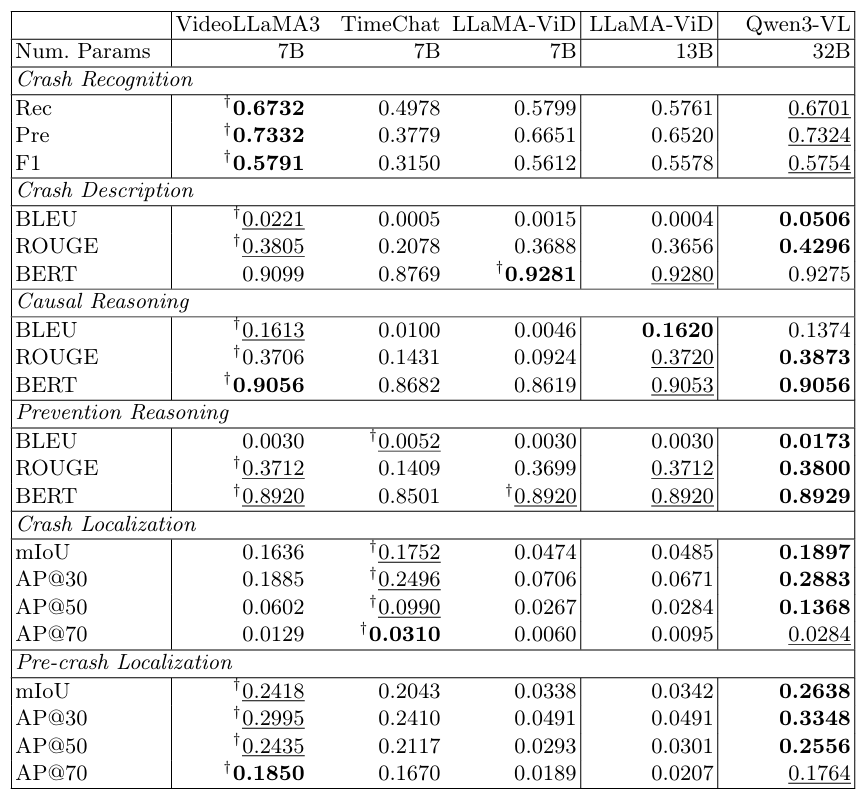

<h2 align="center"> <a href="">CrashChat: A Multimodal Large Language Model for Multitask Traffic Crash Video Analysis</a></h2>

<h4 align="center"> <a href="https://liangkd.github.io/">Kaidi Liang</a>, <a href="">Ke Li</a>, <a href="">Xianbiao Hu</a>, <a href="">Ruwen Qin*</a></h4>

<h5 align="center"> If our project helps you, please give us a star ⭐ on GitHub to support us. 🙏🙏 </h2>

<h5 align="center">

[](https://huggingface.co/KDliang/crashchat)
[](https://huggingface.co/datasets/KDliang/CrashChat)
[](https://arxiv.org/pdf/2512.18878)
[](https://arxiv.org/abs/2512.18878) 
</h5>

## 📰 News
- [25.12.22]  The [paper](https://arxiv.org/abs/2512.18878) has been published on the arvix. 🎉🎉🎉
- [25.12.21]  Release the [Weights](https://huggingface.co/KDliang/crashchat/tree/main/ckpt) and [Datasets](https://huggingface.co/datasets/KDliang/CrashChat/tree/main) of **CrashChat**.
- [25.12.18] Release the initial version of **CrashChat**.


## 🌟 Introduction
- **CrashChat** is a Multimodal Large Language Model specifically designed for traffic crash video analysis. Our model incorporates three key architectural contributions: 
  - (1) a multitask learning approach designed to effectively inject the comprehensive knowledge of crash video analysis into VideoLLaMA3;
  - (2) an MLLM capable of unified crash recognition, temporal grounding, and understanding across diverse scenarios;
  - (3) a comprehensive evaluation that provides the first benchmarking of MLLMs for end-to-end crash video analysis.
- We also construct an instruction-tuning crash video dataset, encompassing six core tasks and a total of 18,385 videos and 96,184 video-QA pairs, to further enhance CrashChat's performance.

<p align="center" width="100%">
<a target="_blank"></a>
</p>


## 🤗 Example Outputs
- **An illustration of linguistic-centric task and perception-centric task of CrashChat**

<p align="center" width="100%">
<a target="_blank"></a>
</p>


<details>
  <summary>💡Click here to show detailed performance on current baseline MLLM</summary>
  
</details>

<details>
  <summary>💡Click here to show detailed performance on coupling and grouping strategy for both linguistic-centric and perception-centric tasks</summary>
  
</details>


## 🤖 Model Zoo (Fine-tuned Checkpoints)

The following checkpoints store learnable parameters (positional linear projection layers, and lora) only.


| Checkpoint | MLLM backbone | Training Strategy - Task | Link |
|----------|-------------|-------------|--------------|
| VideoLLaMA-3 | VideoLLaMA-3 7B | VideoLLaMA3 - baseline | [Weights](https://huggingface.co/KDliang/crashchat/tree/main/ckpt/videollama3_baseline) |
| CrashChat-7B-Finetuned | VideoLLaMA-3 7B | Independent monotask models - crash recognition | [Weights](https://huggingface.co/KDliang/crashchat/tree/main/ckpt/crash_recognition_independent_monotask) |
| CrashChat-7B-Finetuned | VideoLLaMA-3 7B | Independent monotask models - crash description | [Weights](https://huggingface.co/KDliang/crashchat/tree/main/ckpt/crash_description_independent_monotask) |
| CrashChat-7B-Finetuned | VideoLLaMA-3 7B | Independent monotask models - causal reasoning | [Weights](https://huggingface.co/KDliang/crashchat/tree/main/ckpt/causal_reasoning_independent_monotask) |
| CrashChat-7B-Finetuned | VideoLLaMA-3 7B | Independent monotask models - prevention reasoning | [Weights](https://huggingface.co/KDliang/crashchat/tree/main/ckpt/prevention_reasoning_independent_monotask) |
| CrashChat-7B-Finetuned | VideoLLaMA-3 7B | Independent monotask models - pre-crash localization | [Weights](https://huggingface.co/KDliang/crashchat/tree/main/ckpt/pre_crash_localization_independent_monotask) |
| CrashChat-7B-Finetuned | VideoLLaMA-3 7B | Independent monotask models - crash localization | [Weights](https://huggingface.co/KDliang/crashchat/tree/main/ckpt/crash_localization_independent_monotask) |
| CrashChat-7B-Finetuned | VideoLLaMA-3 7B | Homogeneous multitask models - linguistic-centric tasks | [Weights](https://huggingface.co/KDliang/crashchat/tree/main/ckpt/linguistic_centric_homogeneous_multitask) |
| CrashChat-7B-Finetuned | VideoLLaMA-3 7B | Homogeneous multitask models - perception-centric tasks | [Weights](https://huggingface.co/KDliang/crashchat/tree/main/ckpt/perception_centric_homogeneous_multitask) |
| CrashChat-7B-Finetuned | VideoLLaMA-3 7B | Heterogeneous multitask models - all tasks | [Weights](https://huggingface.co/KDliang/crashchat/tree/main/ckpt/heterogeneous_multitask) |


**Notes:**
- Fine-tuned on instruction-tuning data from  
  - [CrashChat-original_01](https://huggingface.co/datasets/KDliang/CrashChat/tree/main/CrashChat-original)
  - [CrashChat-original_02](https://huggingface.co/datasets/KDliang/CrashChat/tree/main/CrashChat-original_02)
  - [CrashChat-resized_01](https://huggingface.co/datasets/KDliang/CrashChat/tree/main/CrashChat-resized)
  - [CrashChat-resized_02](https://huggingface.co/datasets/KDliang/CrashChat/tree/main/CrashChat-resized_02)


## 🛠️ Requirements and Installation

#### Enviroment Preparation 

Step 1: Clone repository:
```
git clone git@github.com:Liangkd/CrashChat.git
cd CrashChat
```

Step 2: Create and activate a Conda environment:
```
conda create -n crashchat python=3.10 -y
conda activate crashchat
```

Step 3, Upgrade pip and install PyTorch (CUDA 11.8):
```
pip install --upgrade pip
pip install torch==2.4.0 torchvision==0.19.0 --extra-index-url https://download.pytorch.org/whl/cu118
```

Step 4, Install required Python dependencies:
```
pip install -r requirements.txt
```

Step 5, Install FlashAttention (local wheel). You can download the cooresponding wheel [here](https://huggingface.co/KDliang/crashchat/tree/main/wheels):
```
pip install /CrashChat/flash_attn-2.7.3+cu11torch2.4cxx11abiFALSE-cp310-cp310-linux_x86_64.whl --no-deps
```

Step 6, Install FFmpeg:
```
conda install -c conda-forge ffmpeg -y
```

#### Prerequisites 

To use our training code, please organize checkpoint as you like under `ckpt`, and then download the corresponding model checkpoint from Model Zoo. For example:
```bash
ckpt
├── videollama3_baseline (required for training)
│   ├── added_tokens.json
│   └── ...
├── crash_recognition_independent_monotask (optional for evaluation)
│   ├── added_tokens.json
│   └── ...
├── crash_description_independent_monotask (optional for evaluation)
│   ├── added_tokens.json
│   └── ...
├── causal_reasoning_independent_monotask (optional for evaluation)
├── prevention_reasoning_independent_monotask (optional for evaluation)
├── pre_crash_localization_independent_monotask (optional for evaluation)
├── crash_localization_independent_monotask (optional for evaluation)
├── linguistic_centric_homogeneous_multitask (optional for evaluation)
├── perception_centric_homogeneous_multitask (optional for evaluation)
└── heterogeneous_multitask (optional for evaluation)
```

To use our training code, please organize the video data and annotations files as you like under `data`. For example:
```bash
data
├── videos
│   ├── cap_1_001537.mp4
│   ├── cap_1_002004.mp4
│   └── ...
├── crashchat_dada_video_total_cause_reasoning_test.json
├── crashchat_dada_video_total_cause_reasoning_train.json
├── ...
└── crashchat_dada_video_total_prevention_reasoning_val.json
```


## 🗝️ Training

#### Step 1: Prepare dataset and checkpoint
Download the database and model weights from Hugging Face; the file organization is as described above.

#### Step 2: Start training
Different shell scripts are used to train models for different tasks. Taking `Independent_monotask_models_causal_reasoning.sh` as an example, the training methods for single-GPU and multi-GPU setups are as follows:
```bash
# single GPU
CUDA_VISIBLE_DEVICES=0 bash /CrashChat/scripts/train/Independent_monotask_models_causal_reasoning.sh 1
# multiple GPUs
CUDA_VISIBLE_DEVICES=1,2 bash /CrashChat/scripts/train/Independent_monotask_models_causal_reasoning.sh 2
```

## ✅ Evaluation

#### Step 1: Prepare evaluation data
Convert the trained weights into weights usable by the model, as shown below. If needed, the [videollama3_original_model](https://huggingface.co/KDliang/crashchat/tree/main/videollama3_original_model) can be downloaded from Hugging Face.
```bash
python CrashChat/tool/merge_and_convert_videollama3_lora.py
```

#### Step 2: Evaluate the test dataset
Get the evaluation JSON file:
```bash
# single GPU
CUDA_VISIBLE_DEVICES=0 bash scripts/eval/eval_video_causal_reasoning.sh
# multiple GPUs
CUDA_VISIBLE_DEVICES=0,1 bash /CrashChat/scripts/train/Independent_monotask_models_causal_reasoning.sh 2
```

#### Step 3: Metric Performance
```bash
python CrashChat/scripts/eval/compute_causal_reasoning_metrics.py
```

## 📑 Citation

If you find CrashChat useful for your research and applications, please cite using this BibTeX:

```bibtex
@article{liang2025crashchat,
  title   = {CrashChat: A Multimodal Large Language Model for Multitask Traffic Crash Video Analysis},
  author  = {Liang, Kaidi and Li, Ke and Hu, Xianbiao and Qin, Ruwen},
  journal = {arXiv preprint arXiv:2512.18878},
  year    = {2025},
  archivePrefix = {arXiv},
  eprint  = {2512.18878},
  primaryClass = {cs.CV},
  url     = {https://arxiv.org/abs/2512.18878}
}
```

## 👍 Acknowledgement

We gratefully acknowledge the open-source projects and datasets that inspired and supported this work, including VideoLLaMA3, MM-AU, Nexar, and D²-City. Their contributions to vision-language modeling and real-world traffic understanding have been invaluable.


## :earth_americas: Contact

If you have any question, please feel free to email me (kaidi.liang@stonybrook.edu) or leave a comment under the 'Issues' module. Thank you!

