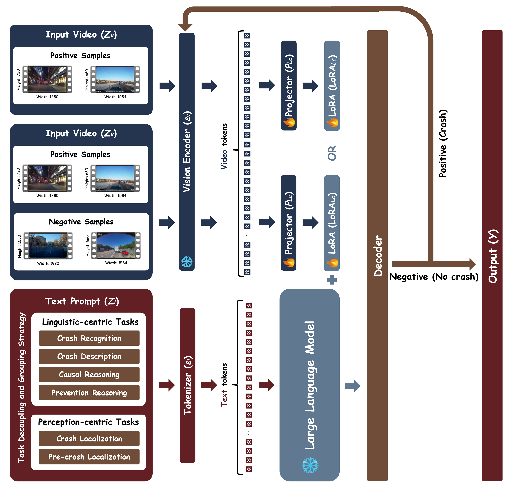

<h2 align="center"> <a href="">CrashChat: A Multimodal Large Language Model for Multitask Traffic Crash Video Analysis</a></h2>

<h4 align="center"> <a href="https://github.com/Liangkd/">Kaidi Liang</a>, <a href="">Ke Li</a>, <a href="">Ruwen Qin*</a></h4>

## News
- [25.12.18]  Release the initial version of **CrashChat**.

## Introduction
- **CrashChat** is a Multimodal Large Language Model specifically designed for traffic crash video analysis. Our model incorporates three key architectural contributions: 
  - (1) a multitask learning approach designed to effectively inject the comprehensive knowledge of crash video analysis into VideoLLaMA3;
  - (2) an MLLM capable of unified crash recognition, temporal grounding, and understanding across diverse scenarios;
  - (3) a comprehensive evaluation that provides the first benchmarking of MLLMs for end-to-end crash video analysis.
- We also construct an instruction-tuning crash video dataset, encompassing six core tasks and a total of 18,398 videos and 96,262 video-QA pairs, to further enhance CrashChat's performance.

## Example Outputs
- **An illustration of linguistic-centric task and perception-centric task of CrashChat**

## Fine-tuned Checkpoints

The following checkpoints store learnable parameters (positional linear projection layers, and lora) only.

| Checkpoint | MLLM backbone | Training Strategy - Task | Link |
|----------|-------------|-------------|--------------|
| CrashChat-7B-Finetuned | VideoLLaMA-3 7B | Independent monotask models - crash recognition | [Weights](https://huggingface.co/KDliang/crashchat/tree/main/ckpt/crash_recognition_independent_monotask) |
| CrashChat-7B-Finetuned | VideoLLaMA-3 7B | Independent monotask models - crash description | [Weights](https://huggingface.co/KDliang/crashchat/tree/main/ckpt/crash_description_independent_monotask) |
| CrashChat-7B-Finetuned | VideoLLaMA-3 7B | Independent monotask models - causal reasoning | [Weights](https://huggingface.co/KDliang/crashchat/tree/main/ckpt/causal_reasoning_independent_monotask) |
| CrashChat-7B-Finetuned | VideoLLaMA-3 7B | Independent monotask models - prevention reasoning | [Weights](https://huggingface.co/KDliang/crashchat/tree/main/ckpt/prevention_reasoning_independent_monotask) |
| CrashChat-7B-Finetuned | VideoLLaMA-3 7B | Independent monotask models - pre-crash localization | [Weights](https://huggingface.co/KDliang/crashchat/tree/main/ckpt/pre_crash_localization_independent_monotask) |
| CrashChat-7B-Finetuned | VideoLLaMA-3 7B | Independent monotask models - crash localization | [Weights](https://huggingface.co/KDliang/crashchat/tree/main/ckpt/crash_localization_independent_monotask) |
| CrashChat-7B-Finetuned | VideoLLaMA-3 7B | Homogeneous multitask models - linguistic-centric tasks | [Weights](https://huggingface.co/KDliang/crashchat/tree/main/ckpt/linguistic_centric_homogeneous_multitask) |
| CrashChat-7B-Finetuned | VideoLLaMA-3 7B | Homogeneous multitask models - perception-centric tasks | [Weights](https://huggingface.co/KDliang/crashchat/tree/main/ckpt/perception_centric_homogeneous_multitask) |
| CrashChat-7B-Finetuned | VideoLLaMA-3 7B | Heterogeneous multitask models - all tasks | [Weights](https://huggingface.co/KDliang/crashchat/tree/main/ckpt/heterogeneous_multitask) |

**Notes:**
- Fine-tuned on instruction-tuning data from  
  - [CrashChat-original](https://huggingface.co/datasets/ShuhuaiRen/TimeIT)
  - [CrashChat-resized](https://huggingface.co/datasets/ShuhuaiRen/TimeIT/blob/main/data/valley/Valley_instruct_73k.json)  

